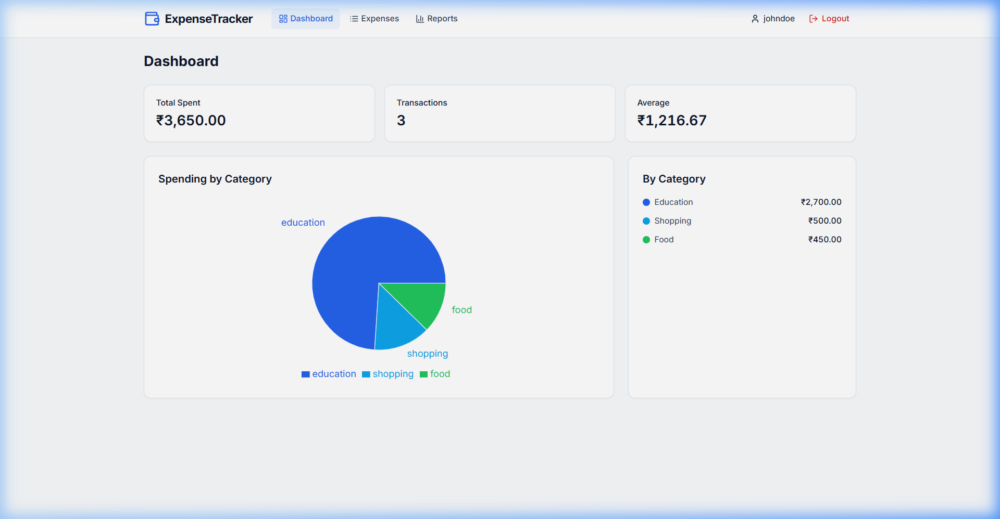
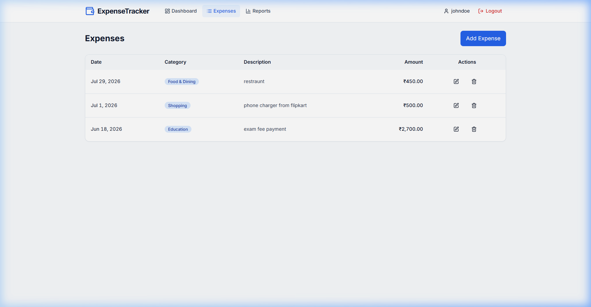
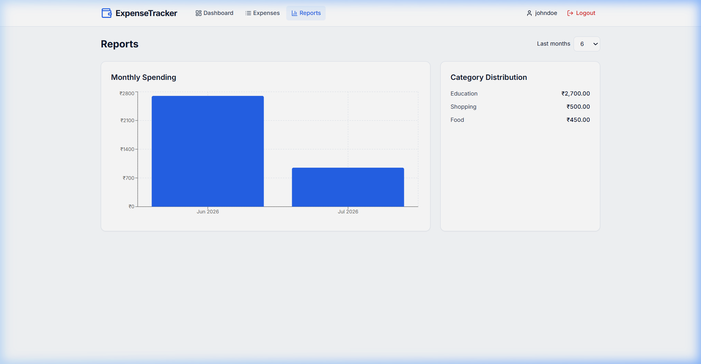

# 💰 Expense Tracker

A full-stack, responsive personal expense management application built with **React 18**, **Node.js**, **Express**, and **MongoDB**. Easily manage your daily transactions in Indian Rupees (₹), categorize spending, and analyze financial trends with interactive data visualizations.

---

## 📸 UI Showcase

### 📊 Interactive Dashboard Overview


### 💸 Expense Management & Filtering


### 📈 Spending Analytics & Reports


---

## ✨ Key Features

- 🔐 **Authentication & Security**: User registration, login, and JWT-backed session persistence with protected routes.
- 💸 **Expense CRUD Operations**: Create, read, update, and delete expenses with full metadata (Category, Description, Date, Payment Method).
- 🏷️ **Categorization**: Multi-category support (*Food & Dining*, *Transportation*, *Housing*, *Utilities*, *Entertainment*, *Healthcare*, *Shopping*, *Education*, *Travel*, *Other*).
- 📊 **Real-time Analytics**: High-level KPI cards displaying **Total Spent**, **Transaction Count**, and **Average Expense**.
- 📈 **Data Visualization**: Category spending pie charts and monthly financial time-series graphs powered by Recharts.
- 🇮🇳 **Indian Rupee (₹) Native Support**: Configured for standard Indian currency (`en-IN`) formatting.
- 🛡️ **Enterprise Security**: Password hashing via `bcryptjs`, Helmet security headers, CORS origin protection, rate limiting, and zero hardcoded secrets.
- 📱 **Responsive UI**: Sleek dark-mode theme designed with Tailwind CSS, fully responsive across mobile and desktop.

---

## 📁 Project Architecture & Specifications

Detailed design specifications and architectural guidelines have been organized in the [`docs/`](docs/) directory:

- 🏗️ [Architecture Specification](docs/Architecture.md) — System design and data flow layout.
- 🎨 [Design Guidelines](docs/Design.md) — UI theme tokens and component standards.
- 📋 [PRD (Product Requirements Document)](docs/PRD.md) — Functional and non-functional requirements.
- 🗓️ [Phases & Milestones](docs/Phases.md) — Implementation roadmap.
- 📐 [Coding Rules](docs/Rules.md) — Standardized code structure and conventions.

---

## 🛠️ Tech Stack

### Frontend
- **Framework**: React 18
- **Routing**: React Router v6
- **Styling**: Tailwind CSS
- **Visualization**: Recharts
- **Icons**: Lucide React
- **HTTP Client**: Axios with automatic request/response interceptors
- **Build Tool**: Vite

### Backend
- **Runtime**: Node.js (v18+)
- **Framework**: Express
- **Database**: MongoDB with Mongoose ORM
- **Validation**: Zod schema validation
- **Security**: JWT (`jsonwebtoken`), `bcryptjs`, `helmet`, `cors`, `express-rate-limit`
- **Documentation**: Swagger UI & OpenAPI 3.0 (`swagger-ui-express`)

---

## 📂 Repository Structure

```
expense_tracker/
├── backend/
│   ├── src/
│   │   ├── config/          # Database connection
│   │   ├── controllers/     # Auth, Expense, and Report controllers
│   │   ├── middleware/      # Auth, Error Handler, and Validation middleware
│   │   ├── models/          # User and Expense Mongoose schemas
│   │   ├── routes/          # API route definitions
│   │   ├── utils/           # Token generator & logger utilities
│   │   ├── app.js           # Express app setup
│   │   ├── server.js        # HTTP server entry point
│   │   └── test_e2e.js      # End-to-End integration test suite
│   ├── .env.example         # Environment template
│   └── package.json
├── frontend/
│   ├── src/
│   │   ├── components/      # UI components (Common, Layout, Expense)
│   │   ├── context/         # AuthContext state provider
│   │   ├── pages/           # Dashboard, Expenses, Reports, Auth pages
│   │   ├── services/        # Axios API service
│   │   └── utils/           # Currency and date helpers
│   ├── index.html
│   ├── vite.config.js
│   └── package.json
├── docs/                    # Architecture, PRD, and design specifications
│   └── screenshots/         # UI preview screenshots (Dashboard, Expenses, Reports)
└── docker-compose.yml
```

---

## 🚀 Getting Started

### Prerequisites
- **Node.js** >= 18.x
- **npm** >= 9.x
- **MongoDB** running locally (`mongodb://localhost:27017`) or MongoDB Atlas

### 1. Installation

Install all root, backend, and frontend dependencies:

```bash
npm run install:all
```

### 2. Environment Configuration

Copy `.env.example` in `backend/` to `.env`:

```bash
cp backend/.env.example backend/.env
```

Configure `backend/.env`:

```env
MONGO_URI=mongodb://localhost:27017/expense_tracker
JWT_SECRET=your_secure_jwt_secret_key
PORT=5000
```

### 3. Running the Application

Start both backend and frontend concurrently:

```bash
npm run dev
```

- 🌐 **Frontend App**: `http://localhost:3000`
- ⚡ **Backend API**: `http://localhost:5000/api/v1`
- 📚 **Interactive Swagger API Docs**: `http://localhost:5000/api-docs`

---

## 🧪 End-to-End Testing

Run the automated integration test suite:

```bash
cd backend
node src/test_e2e.js
```

---

## 📜 License

MIT License © [Piyush Anand](https://github.com/PiyushAnand2006)
